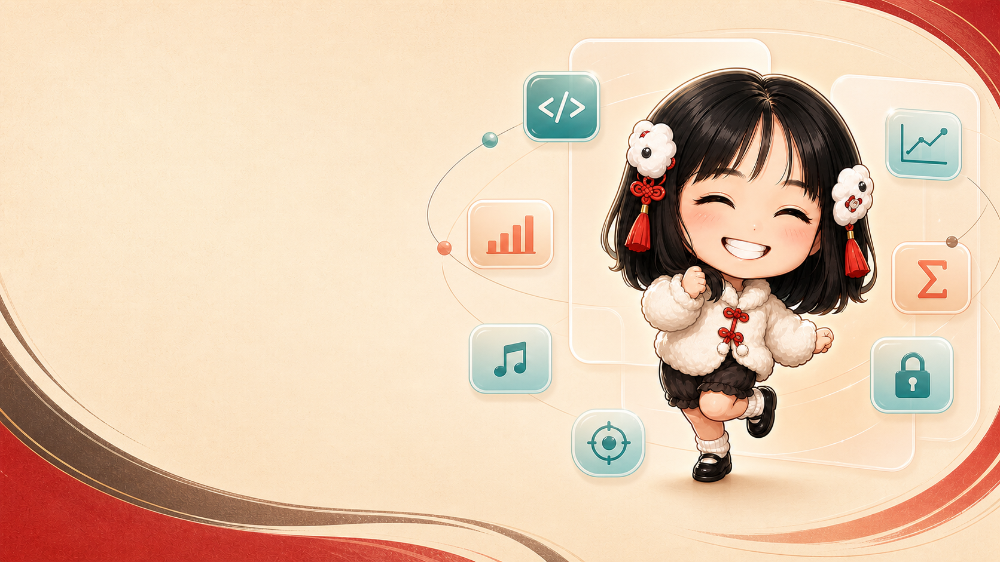
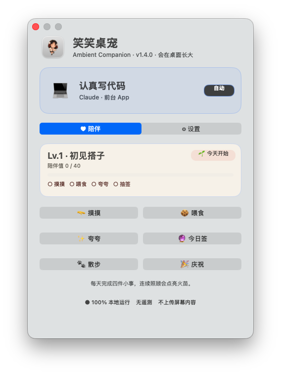

<div align="center">



# 笑笑桌宠

**会看场景、会接话、还能被你慢慢养熟的原生 macOS 桌面搭子。**

[下载最新版](../../releases/latest) · [使用手册](MANUAL.md) · [English](README_EN.md) · [参与贡献](CONTRIBUTING.md)

[](../../releases/latest)
[](../../actions/workflows/build.yml)
[](../../actions/workflows/codeql.yml)


[](LICENSE)

</div>

## 一眼看懂

笑笑常驻桌面，不占 Dock。她会根据前台 App 和可选的本地 OCR，在写代码、
报错、测试通过、表格、盯盘、会议、阅读、摸鱼、深夜加班等 **23 种状态**
间自动切换。每天摸摸、喂食、夸夸和抽签，还会积累经验、连续陪伴天数，
从“初见搭子”一路成长为“灵魂工友”。所有判断和成长记录都只在本机完成。

- **会长大**：4 项每日陪伴、5 个关系等级、经验进度和连续陪伴天数。
- **会互动**：控制中心直达摸摸、喂食、夸夸、抽签、散步和庆祝。
- **会感知**：默认只看前台 App；开启 OCR 后可识别当前窗口中的场景线索。
- **可掌控**：“陪伴／设置”双页控制中心统一管理互动、大小、感知和隐私状态。
- **不打扰**：迷你／标准／大只三档，支持 Option 滚轮微调、鼠标穿透和安静模式。
- **够放心**：无账号、无广告、无遥测、无网络请求，不保存截图或 OCR 文字。
- **双架构**：一个安装包同时支持 Apple Silicon 与 Intel Mac。
- **可访问**：支持键盘焦点、VoiceOver 语义和系统“减少动态效果”。

<p align="center">
  
</p>

## 每天一小圈

打开控制中心就能看到今天的陪伴进度，不必翻右键菜单：

| 今日动作 | 得到什么 |
| --- | --- |
| 摸摸、喂食、夸夸、今日签 | 每项首次完成点亮一格并获得额外经验 |
| 完成 4 项 | 今日全勤奖励、庆祝动画与连续陪伴天数 |
| 戳一下、散步、庆祝 | 随时互动并继续积累经验 |
| 经验升级 | 解锁“熟悉同桌”“默契拍档”“桌面知己”等称号 |

第一次启动 v1.4.0 会直接展示陪伴页。成长数据使用 macOS 用户偏好保存在本机，
不需要账号，也不会联网同步。

## 三分钟上手

1. 打开 [Releases](../../releases/latest)，下载
   `SmilePet-v1.4.0-macos-universal.dmg`。
2. 把“笑笑桌宠”拖到“应用程序”。
3. 第一次启动时，在 Finder 右键 App，选择“打开”并确认。
4. 在首次出现的控制中心完成一项互动，或点击菜单栏笑脸随时再次打开。

当前 Release 使用临时签名，尚未 Apple 公证。请只从本仓库官方 Release 下载，
并可用同页的 `SHA256SUMS.txt` 校验文件。完整步骤见 [用户使用手册](MANUAL.md)。

## 她会变成什么

| 现场 | 状态示例 | 反应 |
| --- | --- | --- |
| 开发 | 写代码、报错、测试通过 | 专注、抢救、撒花 |
| 办公 | 表格、写作、汇报、邮件 | 公式提醒、行动项、清零 |
| 金融与研究 | 盯盘、阅读、资料检索 | 风险提醒、来源检查 |
| 沟通与创作 | 会议、消息、设计 | 静音、守红点、灵感施工 |
| 生活 | 视频、音乐、游戏、购物 | 摸鱼、摇摆、冷静十分钟 |
| 节奏 | 长时间工作、离开、深夜 | 工位服刑、守桌面、催下班 |

全部状态、识别条件和权限说明见 [用户使用手册](MANUAL.md#6-场景感知)。

## 隐私边界

```text
默认模式       前台 App 名称 / Bundle ID  →  本地分类  →  状态
可选 OCR       当前前台窗口截图            →  Vision 内存识别  →  状态
不会发生       保存截图 / 保存文字 / 上传 / 遥测 / 广告
```

OCR 默认关闭，只有用户主动开启后才请求屏幕录制权限。随时可以在控制中心关闭，
或在系统设置中撤销权限。详见 [PRIVACY.md](PRIVACY.md) 与
[SECURITY.md](SECURITY.md)。

## Codex 笑笑皮肤

仓库附带一整套 Codex 原生皮肤：88 帧笑笑桌宠、暖白／墨棕界面、漆红强调色，
以及匹配的 Rosé Pine 代码主题。它使用 Codex 官方自定义桌宠与主题配置，
不修改官方 App 包和签名。桌宠 App 与 Codex 皮肤彼此独立，可以任选其一。

```bash
./scripts/install-codex-skin.sh
```

安装前会校验 Codex 与精灵图，并自动备份 `~/.codex/config.toml`；需要恢复时运行
`./scripts/uninstall-codex-skin.sh`。详情见 [CodexSkin/README.md](CodexSkin/README.md)。

## 从源码构建

```bash
xcode-select --install
git clone https://github.com/flukier1016/smile-desktop-pet.git
cd smile-desktop-pet
./scripts/security-check.sh
./scripts/test.sh
./build.sh
open "笑笑桌宠.app"
```

生成的是 macOS 13+、Apple Silicon＋Intel 通用、临时签名的原生 App。
打包 Release：

```bash
./scripts/package-release.sh 1.4.0
```

## 开源与参与

- Swift 源代码、文档和构建工具采用 [MIT License](LICENSE)。
- 角色图片、图标、Codex 精灵图及其派生素材不在 MIT 授权范围内，详见
  [ASSET_NOTICE.md](ASSET_NOTICE.md)。
- 原始人物照片从未提交到仓库、CI 或 Release。
- Bug、功能建议和首次贡献请从 [Issues](../../issues) 开始；安全问题请使用
  [私密漏洞上报](../../security/advisories/new)。
- 开发规范、测试要求和素材边界见 [CONTRIBUTING.md](CONTRIBUTING.md)。

## 当前路线

- Apple Developer ID 签名与公证。
- 更多社区场景规则和可替换角色包。
- 可导入的社区角色包和更多陪伴事件。

喜欢这个项目，可以点一个 Star、分享 Release，或贡献一条新的场景台词。
